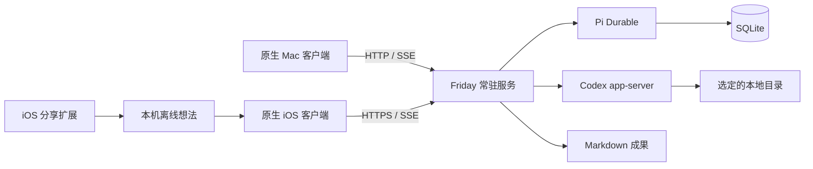

# Friday 的执行边界

Friday 保存长期产品状态，客户端负责交互，CLI 工具执行具体工作。关窗、网络断开和执行进程生命周期互不绑定。0.1 的主机和执行器部署在同一台 Mac；远程独立执行节点尚未实现。

## Pi Durable 的职责

`friday.execute` 是实际注册到 Pi Durable 的持久任务，使用它的 checkpoint、memo、等待依赖和终止状态。任务创建和应用状态更新在同一 Durable commit 中保存。所有任务按创建/继续的顺序串行执行，避免多个代码任务同时改同一目录。

Pi Durable 不是 CLI 外部副作用的事务管理器。Friday 在启动外部 turn 前保存 external-started 标记与 thread ID；重启后不确定的 turn 需要用户继续。Pi Durable 的存储由单进程持有，另一个 SQLite writer transaction 用作会随进程退出而释放的占用锁。

当前没有在 Pi 内额外运行一个自主规划模型。调研/代码任务直接委派 Codex；这保留了今后引入个人助理会话、模型规划、周期任务与其他 executor 的位置，也避免第一版重复支付两层模型的费用。

## Codex 适配器

通过 CLI 的 `app-server --listen stdio://` 使用 JSONL 双向 RPC。Friday 创建自己的原生 Codex thread，保存 ID 后启动 turn；继续任务使用 thread/resume，补充要求使用 turn/steer，停止使用 turn/interrupt 并结束连接。

调研任务使用 read-only，代码任务使用 workspace-write；审批策略为 on-request、reviewer 为用户。工具请求只有在能显示具体范围时才接入；未知权限请求保守拒绝。CLI 原生的文件系统与网络隔离仍是实际执行边界，提示词只补充行为约定。

第一版管理的是 Friday 创建的任务。没有宣称能接管 Codex 桌面端、Claude Code 或其他工具已经打开的任意会话。

## 三层记忆

| 层 | 内容 | 写入与读取 |
| --- | --- | --- |
| Session Memory | 当前任务的 thread、输出、执行记录 | 执行过程中写入，续聊复用原生会话 |
| SQLite Long-term Memory | 用户明确保存的偏好、项目背景 | UI 中增改删；任务创建时注入当前快照 |
| Skill Memory | `skills/*/SKILL.md` 中可复用工作流程 | 维护文件；按任务模式读取并固化到任务输入 |

没有从全屏监控或输入法中自动抽取记忆。全量个人数据不默认发给每一次任务；目前注入的是用户保存的显式记忆和关联项目背景。未来应增加按相关性选择、来源及过期管理。

## 同步与授权

HTTP 负责命令，SSE 发送带 revision 的完整状态快照。重连先拉最新状态，无需假设客户端收到每个 token。客户端离线只缓存想法，稳定的 idea ID 防止重复；任务命令通过 request ID 去重。手机后台不维持永久在线承诺。

本机 owner token 存在私有文件，远端设备各自拥有可撤销 token，服务只保存其哈希。配对不携带旧主机凭据。外部访问要求 TLS；Tailscale 可提供设备间私网入口，但不替代 Friday 的授权。

## 第一版规模

一个用户、一个服务、一条执行队列，一个有上限的 workspace document。当前最多 300 个任务、100 条显式记忆，每任务保存最近 120 条执行事件，流式预览限制 80k 字符。原始完整会话由 Codex 保存。没有提供任务归档/清理 UI；达到任务上限后需要增加归档能力再继续扩展。

后续增加多 executor 时，保持 run、answer、steer 的边界，同时显式描述每个工具的继续、取消、授权、事件和成果能力；不要假定所有 CLI 都支持同样的协议。
