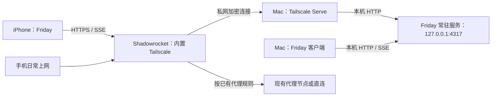

# Connections：主机连接、设备授权与同步

Connections 管理客户端如何连接 Friday 主机、哪些设备可以访问数据，以及主机使用哪个模型服务。Friday 常驻服务在 Mac 上执行任务并保存状态；客户端通过 HTTP 命令和 SSE 快照查看、管理同一个 Friday。

## 界面与职责

| 能力 | Mac 入口 | iPhone 入口 | 当前行为 |
| --- | --- | --- | --- |
| 主机连接 | 设置 → 设备管理 → 当前主机 | 设置 → 连接与设备 → 当前主机 / 配对到主机 | Mac 查看本机连接状态并重新连接；iPhone 查看主机地址、填写远端地址并配对 |
| 设备授权 | 设置 → 设备管理 | 设置 → 连接与设备 → 设备访问 | 本机主机所有者生成配对码、查看设备、撤销访问；配对设备提示回到主机管理 |
| 模型连接 | 设置 → 模型服务 | 设置 → 连接与设备 → 模型 | 所有设备查看模型和配置状态；只有主机所有者能验证、保存或移除 DeepSeek API Key |

文档中的 Connections 是这些能力的统称。Mac 作为主机，移除独立的“主机连接”页与“配对到主机”表单，把连接状态和重新连接并入设备管理；iPhone 保留完整主机配对入口。模型服务仍单独配置，主机连接成功与模型配置成功是两个独立状态。

## 推荐接入：Tailscale 私网 + HTTPS

使用 [Tailscale Serve](https://tailscale.com/docs/features/tailscale-serve) 将 Mac 上的 Friday 服务提供给同一 tailnet 中有访问权限的设备。Friday 默认继续监听 `http://127.0.0.1:4317`，Serve 提供私网 HTTPS 入口并在 Mac 本机转发请求。



手机无需常驻代理时，可以直接使用官方 Tailscale 客户端。需要常驻 Shadowrocket 时，使用其内置 Tailscale 模块，由同一个 VPN 隧道处理普通代理与私网连接，官方 Tailscale App 保持断开。这种组合已通过 Friday 真机验收；模块与本地 MagicDNS 支持也见 [Shadowrocket 开发者发布说明](https://apps.apple.com/us/app/shadowrocket/id932747118)。

网络连通和数据授权分别完成：Tailscale 让手机到达主机，Friday 配对决定该设备能否查看和管理 Friday。私网设备仍需要 Friday 设备凭据。

### 1. 准备 Mac 的 HTTPS 入口

先启动 Friday 常驻服务，并让 Mac 登录目标 tailnet。以下命令配置 HTTPS 443 端口，后台转发到默认 Friday 端口：

```sh
tailscale serve --bg --https=443 http://127.0.0.1:4317
tailscale serve status
```

使用 Tailscale 原生 macOS App、且未安装独立 `tailscale` 命令时，可通过应用内 CLI 执行：

```sh
TAILSCALE_BE_CLI=1 /Applications/Tailscale.app/Contents/MacOS/Tailscale serve --bg --https=443 http://127.0.0.1:4317
TAILSCALE_BE_CLI=1 /Applications/Tailscale.app/Contents/MacOS/Tailscale serve status
```

首次使用按 CLI 提示启用所需的 HTTPS 配置。复制状态输出中的完整地址，例如 `https://friday-host.<tailnet>.ts.net`；示例中的设备名和 tailnet 需要替换为实际输出。自定义 Friday 端口时也要调整转发目标。

如果此前在同一端口使用了 Funnel，重新配置 Serve 会将该端口切回私网；检查输出应为 `Available within your tailnet`。Serve 与 Funnel 在同一端口的访问范围由最后一次配置决定，见 [Serve 的端口限制](https://tailscale.com/docs/features/tailscale-serve#limitations)。

### 2. 让手机加入同一私网

使用 Shadowrocket 时，在“设置 → Tailscale”填入来自同一 tailnet 管理控制台的入网认证密钥，然后开启模块和小火箭连接。个人常驻手机建议使用单次、非临时设备的认证密钥：单次表示只注册一台设备；非临时设备表示不会因离线而被自动移除。

认证密钥用于注册设备，后续通信使用设备自身的身份。入网密钥用完或到期，不会立即撤销已注册设备；设备身份有独立的有效期。详见 [Tailscale 认证密钥](https://tailscale.com/docs/features/access-control/auth-keys)。

### 3. 验证入口，再配对 Friday

1. 在手机 Safari 打开完整 HTTPS 地址加 `/health`。返回 `name: Friday`、`status: ok` 的 JSON，说明 DNS、网络、HTTPS 和服务入口可用；此检查不代表 Friday 已配对。
2. 在 Mac 的“设置 → 设备管理”生成配对码。
3. 在 iPhone 的“设置 → 连接与设备 → 配对到主机”填入同一 HTTPS 地址、设备名称和 6 位配对码，点击“连接”。
4. 确认当前主机显示已连接，并能查看主机的真实想法与任务；分别从手机和主机保存一条临时想法，确认双向更新后删除测试数据。

Friday 配对码 5 分钟内有效，只能使用一次。主机同一时间只保留一组有效码，生成新码会替换旧码。配对成功后客户端把设备凭据存入系统钥匙串，主机地址保存到客户端设置；后续打开 App 不需要重复输入配对码。

已配对设备仍会显示“配对到主机”表单，这不表示授权未完成。日常查看页面上方“当前主机”的连接状态；切换网络后若离线，先点击“重新连接”，不用再次填写配对码。

## Shadowrocket 的 Tailscale 配置

以下含义根据已使用版本的界面说明整理；不同版本的选项名称和行为可能调整。推荐值面向“普通代理继续使用，Friday 通过私网访问”。

| 选项 | 含义 | 此场景的设置 |
| --- | --- | --- |
| 启用 | 启用处理 tailnet 流量的模块；修改设置时隧道会重新加载模块 | 开启 |
| 低电量模式 | 首次网络同步后，空闲时释放网络资源，按需重新连接；空闲期间不刷新网络变化 | 先关闭以减少重连等待，日后可单独验证省电效果 |
| 认证密钥 | `tskey-auth-` 开头的设备入网凭证 | 填入同一 tailnet 的有效认证密钥；与 Friday 配对码、模型 API Key 分别管理 |
| 控制服务器 URL | 负责设备身份、网络配置和连接协调的控制服务地址 | 留空使用默认服务；Friday 的 HTTPS 地址填在 Friday App 中 |
| 出口节点 | 将普通互联网流量也经指定 tailnet 设备转发，例如通过家中 Mac 上网 | 留空，只处理私网流量，保留已有代理分流 |
| 始终使用 DERP | 强制使用中继服务器，禁用直接 UDP 通道 | 关闭，让连接自动选择路径；遇到直连相关问题时再单独测试开启 |
| 使用 Tailscale 子网 | 接受子网路由器发布的路由，访问其后面的局域网设备 | 本次验收保留开启；直接访问已安装 Tailscale 的 Mac 不依赖子网路由 |
| 重置 Tailscale 标识 | 涉及重置本机的私网设备身份；具体范围由小火箭实现决定，可能需要重新认证 | 正常使用不需要操作 |

控制服务管理身份、设备信息、DNS 和路由配置，实际加密数据由设备之间传输，见 [控制面与数据面](https://tailscale.com/docs/concepts/control-data-planes)。[出口节点](https://tailscale.com/docs/features/exit-nodes)解决“通过谁上互联网”；[子网路由](https://tailscale.com/docs/features/subnet-routers)解决“如何访问另一处局域网”。例如远程访问未安装 Tailscale 的 NAS，需要先在家中配置并批准子网路由，仅开启手机上的选项不会自动建立路由。

### MagicDNS：用设备名找到私网地址

[MagicDNS](https://tailscale.com/docs/features/magicdns) 自动为私网设备注册名称，完整名称由设备名和 tailnet 域名组成：

```text
friday-host.<tailnet>.ts.net → Mac 的 Tailscale 私网 IP
```

只要设备身份和名称保留，Mac 更换 Wi-Fi 或局域网地址时，客户端仍可沿用这个名称。Friday 使用 Serve 输出的完整 HTTPS 域名；不要自行换成短设备名或 IP，以免与 HTTPS 证书名称不一致。

MagicDNS 负责名称解析，HTTPS 负责加密，Friday 凭据负责数据访问。注册一个域名不会自动发布服务到公网。

修改 Tailscale 设备名也会改变 MagicDNS 域名。改名后需要更新 Serve 的 HTTPS 映射，并先验证新地址的 `/health`；Friday 钥匙串凭据按完整主机地址保存，因此客户端也需要用新地址重新配对。新连接确认可用后，再清理旧地址映射和同一设备的旧授权。

### DERP：无法直连时转发加密数据

[DERP](https://tailscale.com/docs/reference/derp-servers) 帮助设备建立连接，也在其他连接路径不可用时转发数据：

```text
直接连接：iPhone ↔ Mac
DERP 中继：iPhone ↔ DERP 服务器 ↔ Mac
```

中继通常增加延迟，实际表现取决于网络和中继位置。数据仍由设备端到端加密，DERP 无法解密 Friday 内容。“始终使用 DERP”关闭只取消强制中继，需要时仍可自动使用 DERP；使用中继不改变 Friday 的设备授权要求。

## Friday 的接口、凭据与权限

| 接口 | 权限 | 用途 |
| --- | --- | --- |
| `GET /health` | 无需 Friday 凭据 | 检查服务入口是否可用 |
| `POST /pair` | 有效配对码 | 注册设备，返回设备 ID 和凭据 |
| `POST /api/pairing` | 主机所有者 | 生成新的单次配对码 |
| `DELETE /api/devices/:id` | 主机所有者 | 撤销设备访问 |
| `GET /api/state` | 主机或已配对设备 | 拉取完整状态、设备列表及当前设备身份 |
| `GET /api/events` | 主机或已配对设备 | 接收 SSE 状态快照与心跳 |
| `GET /api/model` | 主机或已配对设备 | 查看模型名称和配置状态，不返回密钥 |
| `PUT /api/model/key`、`DELETE /api/model/key` | 主机所有者 | 验证保存或移除模型密钥；有正在处理的 Friday 会话时拒绝修改 |

客户端对 `/api/*` 发送 Bearer 凭据。服务在私有 `owner-token` 文件中保存本机所有者凭据，在 `access.sqlite` 中保存设备凭据与配对码的哈希。主机可以逐台撤销设备；SSE 循环也会检查凭据有效性，使撤销后的连接结束。加入 tailnet 不会获得主机所有者权限。

配对设备的凭据由 Apple Keychain 保存，按主机地址区分，并使用仅限本设备的保护属性。远端 HTTP 地址会被客户端拒绝；明文 HTTP 仅允许本机回环地址。更换主机 URL 时，应在客户端重新完成配对流程。

DeepSeek API Key 由主机独立保存在 `model-auth.json`，不发给手机。验证失败保留原密钥；“已配置”表示主机存在已保存的密钥，持续可用性仍需实际模型请求确认。手机主机已连接、想法能同步，不等于模型已可用。

## 同步与离线行为

- 连接时先请求 `/api/state`，成功后标为已连接，再订阅 `/api/events`。SSE 使用 `snapshot` 事件发送带 revision 的完整状态，另有心跳；重连重新拉取最新状态，不依赖补齐每个旧事件。
- 流结束或请求失败后标为离线，约 3 秒后重试；“重新连接”会取消原连接任务并启动新连接。
- 想法先进入设备本地 outbox，连接恢复后按原 idea ID 提交，主机按 ID 去重。任务命令需要在线提交，使用 request ID 去重。
- 主机任务与客户端窗口、连接寿命独立。Mac 需在线且服务运行；休眠、关机时无法继续处理任务。
- iPhone 在前台通过 SSE 更新，回到前台重新连接。当前没有 APNs，不承诺手机后台持续同步。FridayPersonal 不包含分享扩展；含扩展的版本在打开主 App 后导入共享想法。

## 公网备选：Tailscale Funnel

[Funnel](https://tailscale.com/docs/features/tailscale-funnel) 可以让手机通过普通 HTTPS 访问主机，手机无需加入 tailnet；Mac 仍需要在线并运行 Tailscale。它会将服务入口变为公网可达，`/health` 和配对入口也随之可达，`/api/*` 继续要求 Friday 凭据。

个人使用优先采用上述私网组合。只有明确选择公网接入时才配置 Funnel，切换前核对访问范围；域名后缀相同不能说明当前入口是私网还是公网，应以 Serve / Funnel 配置为准。

## 排障顺序

| 现象 | 下一步检查 |
| --- | --- |
| Safari 无法打开 `/health` | 先检查主机服务和 Serve 状态，再确认手机入网、MagicDNS、访问规则及 HTTPS 地址；先解决入口，再生成新配对码 |
| 能用 Tailscale IP 连到主机，但完整域名无法解析 | 检查 MagicDNS 和客户端 DNS 处理；恢复域名解析后仍使用完整 HTTPS 地址 |
| `/health` 正常，Friday 配对失败 | 确认主机地址一致、名称已填、配对码是最新且未使用；码到期则在主机生成新码 |
| 已配对，切换网络后超时，但 Safari 的 `/health` 正常 | 先点“当前主机 → 重新连接”，确认上方状态；再次配对表单中的旧错误不代表设备凭据已失效 |
| 提示连接授权失效 | 在主机检查设备是否已撤销，按需要重新配对；网络入网密钥不能替代 Friday 凭据 |
| 打开官方 Tailscale 后小火箭断开 | 使用小火箭内置模块，官方 Tailscale 保持断开；避免切换两个独立的个人 VPN 连接 |
| 连接成功但没有实时更新 | 保持 Friday 在前台，检查 SSE 是否持续连接；点“重新连接”并比较最新状态，不能只凭 `/health` 判断同步正常 |
| 更换 Wi-Fi 后旧局域网地址失效 | 使用 Serve 输出的完整域名，检查 Mac 是否在线；客户端无需跟随局域网 DHCP 地址变化 |
| Friday 已连接，但对话提示模型未配置 | 在主机的“模型服务”验证并保存 DeepSeek API Key，模型请求单独验收 |

## 验收记录与边界

2026-10-07 在 iPhone 真机和 Wi-Fi 网络下完成以下检查：

| 检查 | 结果 |
| --- | --- |
| FridayPersonal 签名编译、安装、开发者信任 | 已通过 |
| Shadowrocket 常驻代理 + 内置 Tailscale 入网 | 已通过；普通代理上网同时可用 |
| 手机经私网 HTTPS 打开 `/health` | 已通过 |
| Friday 主机配对、手机查看真实主机数据 | 已通过 |
| 手机保存想法 → 主机读取 | 已通过 |
| 主机保存想法 → 手机前台 SSE 更新 | 已通过；无需手动刷新 |
| 关闭公网 Funnel，保留私网 Serve | 已核对配置 |

同日追加主机改名与蜂窝网络检查：新域名的 HTTPS 证书和带认证的状态接口通过主机侧验证，手机重新配对后生成新授权；手机在 5G 下通过 Safari 打开 `/health`，用户确认点击 Friday 的“重新连接”后可用。改名前同一设备的旧授权已撤销，新授权保留。此结果不代表切网自动恢复或蜂窝网络下的持续 SSE、双向同步已通过验收。

测试想法已清理。蜂窝网络下的持续同步与自动恢复、长期后台 / 省电行为、设备身份到期后的恢复、撤销当前设备时的真机表现，以及包含分享扩展的 Friday scheme 尚未在此次流程中验收。真实 DeepSeek 推理不属于此次网络验收范围。

文档使用示例名称与地址，不记录真实入网密钥、配对码、设备凭据、个人网络配置或会话内容。

## 实现位置

- [连接界面与模型配置](../apps/apple/Sources/FridayKit/SettingsViews.swift)、[Mac 设置导航](../apps/apple/Sources/FridayKit/FridaySettingsView.swift)、[iOS 导航](../apps/apple/Sources/FridayKit/FridayRootView.swift)。
- [HTTP、地址校验与 Keychain](../apps/apple/Sources/FridayKit/Connection.swift)。
- [连接、SSE、配对与离线 outbox](../apps/apple/Sources/FridayKit/FridayStore.swift)。
- [服务接口与权限检查](../server/src/api.ts)、[设备授权与配对码](../server/src/auth.ts)、[模型凭据与验证](../server/src/model.ts)。
